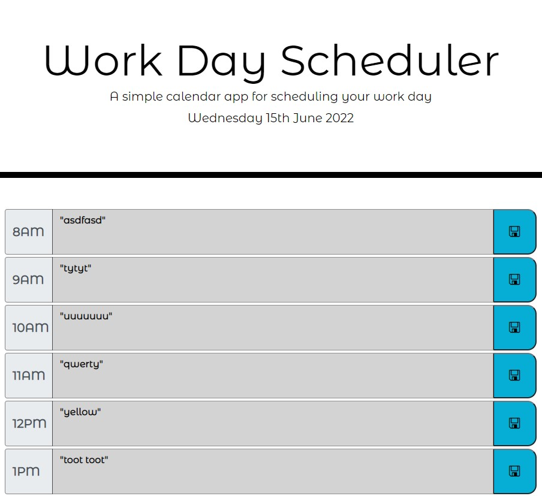
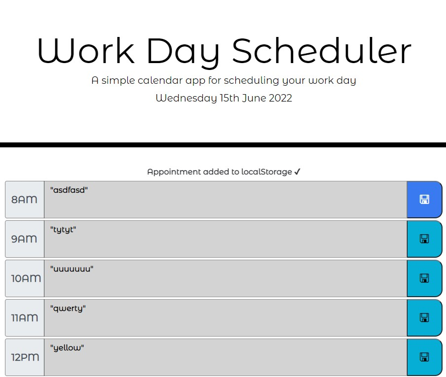

# develoPLANNER
A Work/Job Planner for Developers

## Software Application summary
This software is designed to be a tool for busy developers and the professionals to schedule tasks or any appointment against an time period of an hour over the working day. The Save button will save that so the schedules saved in the application can be accessed any time.

## Inspiration

I had the inspiration to build the DeveloPLANNER from needing a planner schedule which would help me keep track of the tasks and study i needed to complete as my day had got a whole lot busier after taking on study.

## Updates

I updated the starter code with some basic templates code from Bootstrap to provide a textarea and buttons in a succinct clean layout.
I designed it so that the majority of the design would be based in HTML and then any dynamic changes would be changed with jquery or css for small ui animations etc.
This was to simplify the code and so it was less likely to break with less jquery or dynamic sections. 
I then used the moment library to adjust the time display format. Following this I needed to update the textarea's to change color by adding a class with a linked css code. I completed this by conditional functions that would test the time set at the top against the data-attribute which was set to the hour of the day. I used 24hr format so that the if conditionals would work correctly as the hour increased right the way through from 8am to 5pm (08-17).
I then set the schedule text to a key; being the hour that it corresponded to. I then retrieved the key and it's schedule value from local storage by looping through each data attribute (hour in the schedule) and retrieving the value saved in local storage and displaying in the textarea.

## Skills and Knowledge learned

This project continued to push my skils and knowledge.
I really enjoyed employing bootstrap, jquery and moment for the first time. The simplicity of moment was great to work with.
The power of Bootstrap was impressive and made designing the application that much more ufn knowing how much time it could have been taking if I was fiddling around with css to complete the same result.
I am becoming more familiar with functions and how they change and relate to the elements in the DOM.
Further developed my knowledge around localStorage for setting and getting items from the storage. 

I continue to feel my overall knowledge of javascript and application code design is improving. I am still focussing on developing my knowledge of the technicality of the javascript code as I struggle to implement what I am thinking often. I can build some code that is often close to the working code with a couple small changes to complete it.

## Application Example Images & Videos
### Main Schedule Screen

### Schedule popup on Save-Button Press

### Schedule in Action

## Credits
  - (https://api.jquery.com/data/)[api.jquery.com]
  - (https://www.w3schools.com/js/js_number_methods.asp)[w3schools.com]
  - (https://stackoverflow.com/questions/32913226/auto-refresh-page-every-30-seconds)[stackoverflow.com]
  - (https://stackoverflow.com/questions/1911290/make-div-text-disappear-after-5-seconds-using-jquery)[stackoverflow.com]
  - (https://api.jquery.com/fadeout/)[api.jquery.com]
